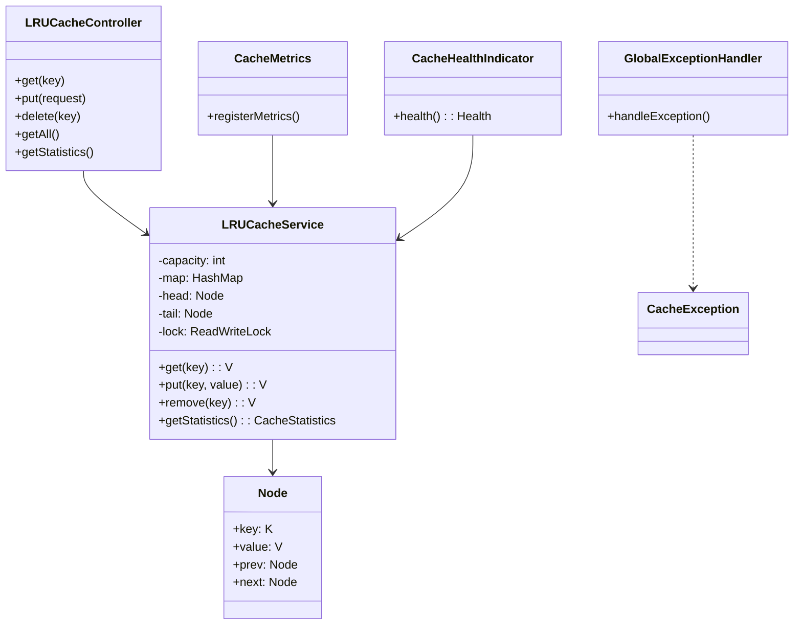

# LRU Cache Microservice - System Design

## Overview

This document describes the design and implementation of an LRU (Least Recently Used) Cache microservice built with Spring Boot. The service provides a high-performance, thread-safe caching solution with REST API endpoints, comprehensive monitoring, and extensibility features.

## Table of Contents

1. [Requirements](#requirements)
2. [Architecture](#architecture)
3. [Data Structures](#data-structures)
4. [API Design](#api-design)
5. [Concurrency Handling](#concurrency-handling)
6. [Non-Functional Requirements](#non-functional-requirements)
7. [Extensibility](#extensibility)
8. [Deployment](#deployment)

---

## Requirements

### Functional Requirements

1. **Basic Cache Operations**
   - `GET(key)`: Retrieve a value by key
   - `PUT(key, value)`: Insert or update a key-value pair
   - `DELETE(key)`: Remove a key-value pair
   - `CLEAR()`: Remove all entries from the cache

2. **LRU Eviction Policy**
   - Automatically evict least recently used items when cache reaches capacity
   - Maintain access order using doubly linked list

3. **Cache Management**
   - Configurable capacity
   - Size tracking
   - Key existence checking

4. **Statistics & Monitoring**
   - Cache hit/miss counts
   - Eviction count
   - Hit rate calculation
   - Current size and capacity

### Non-Functional Requirements

1. **Performance**
   - O(1) average time complexity for get() and put() operations
   - Low latency (< 1ms for cache operations)
   - High throughput (10,000+ operations/second)

2. **Concurrency**
   - Thread-safe operations
   - Support for concurrent reads and writes
   - No data corruption under high concurrency

3. **Scalability**
   - Horizontal scaling capability
   - Stateless design (can be replicated)
   - Configurable capacity per instance

4. **Reliability**
   - Graceful error handling
   - Health check endpoints
   - Comprehensive logging

5. **Observability**
   - Metrics exposure (Prometheus compatible)
   - Health indicators
   - Request/response logging

6. **Extensibility**
   - Easy to add new eviction policies
   - Pluggable storage backends
   - Customizable expiration policies

---

## Architecture

### High-Level Architecture

```
┌─────────────────────────────────────────────────────────┐
│                    Client Applications                    │
└────────────────────┬──────────────────────────────────────┘
                     │ HTTP/REST
                     │
┌────────────────────▼──────────────────────────────────────┐
│              LRU Cache Microservice                        │
│  ┌────────────────────────────────────────────────────┐  │
│  │         REST API Layer (Controller)                 │  │
│  │  - GET /api/v1/cache/{key}                          │  │
│  │  - POST /api/v1/cache                               │  │
│  │  - DELETE /api/v1/cache/{key}                       │  │
│  │  - GET /api/v1/cache/stats                          │  │
│  └──────────────────┬──────────────────────────────────┘  │
│                     │                                      │
│  ┌──────────────────▼──────────────────────────────────┐  │
│  │         Service Layer (LRUCacheService)              │  │
│  │  - Thread-safe operations                            │  │
│  │  - LRU eviction logic                                │  │
│  │  - Statistics tracking                               │  │
│  └──────────────────┬──────────────────────────────────┘  │
│                     │                                      │
│  ┌──────────────────▼──────────────────────────────────┐  │
│  │         Data Structure Layer                         │  │
│  │  - HashMap<K, Node<K,V>> (O(1) lookup)              │  │
│  │  - Doubly Linked List (maintain order)              │  │
│  └─────────────────────────────────────────────────────┘  │
└────────────────────────────────────────────────────────────┘
                     │
┌────────────────────▼──────────────────────────────────────┐
│              Monitoring & Observability                    │
│  - Spring Actuator (Health, Metrics)                      │
│  - Custom Health Indicators                               │
│  - Micrometer Metrics                                     │
└───────────────────────────────────────────────────────────┘
```

### Component Diagram



---

## Data Structures

### Core Data Structure: Doubly Linked List + HashMap

The LRU Cache uses a combination of:
1. **HashMap<K, Node<K,V>>**: For O(1) key lookup
2. **Doubly Linked List**: For maintaining access order

```
HashMap:                    Doubly Linked List:
┌─────┬──────┐              ┌─────┐    ┌─────┐    ┌─────┐
│ key │ Node │              │ MRU │───▶│ ... │───▶│ LRU │
└─────┴──┬───┘              └─────┘    └─────┘    └─────┘
         │                    ▲                        │
         └────────────────────┴────────────────────────┘
```

**Node Structure:**
```java
class Node<K, V> {
    K key;
    V value;
    Node<K, V> prev;  // Previous node (towards LRU)
    Node<K, V> next;  // Next node (towards MRU)
}
```

### Operations Complexity

| Operation | Time Complexity | Space Complexity |
|-----------|----------------|------------------|
| get(key)  | O(1) average   | O(1)            |
| put(key, value) | O(1) average | O(1)            |
| remove(key) | O(1) average | O(1)            |
| containsKey(key) | O(1) average | O(1)            |
| getAll() | O(n) | O(n)            |

---

## API Design

### REST Endpoints

#### 1. Get Value
```http
GET /api/v1/cache/{key}
```

**Response (200 OK):**
```json
{
  "key": "user:123",
  "value": "John Doe",
  "success": true,
  "message": "Value retrieved successfully"
}
```

**Response (404 Not Found):**
```json
{
  "key": "user:123",
  "success": false,
  "message": "Key not found in cache"
}
```

#### 2. Put Value
```http
POST /api/v1/cache
Content-Type: application/json

{
  "key": "user:123",
  "value": "John Doe"
}
```

**Response (200 OK):**
```json
{
  "key": "user:123",
  "value": "John Doe",
  "success": true,
  "message": "Value added successfully"
}
```

#### 3. Update Value
```http
PUT /api/v1/cache/{key}
Content-Type: application/json

{
  "value": "Jane Doe"
}
```

#### 4. Delete Value
```http
DELETE /api/v1/cache/{key}
```

#### 5. Check Key Exists
```http
HEAD /api/v1/cache/{key}
```

#### 6. Get All Entries
```http
GET /api/v1/cache
```

**Response:**
```json
{
  "key1": "value1",
  "key2": "value2",
  ...
}
```

#### 7. Clear Cache
```http
DELETE /api/v1/cache
```

#### 8. Get Statistics
```http
GET /api/v1/cache/stats
```

**Response:**
```json
{
  "currentSize": 85,
  "capacity": 100,
  "hitCount": 1250,
  "missCount": 150,
  "evictionCount": 25,
  "putCount": 200,
  "getCount": 1400,
  "hitRate": 0.8928571428571429
}
```

#### 9. Get Cache Info
```http
GET /api/v1/cache/info
```

**Response:**
```json
{
  "size": 85,
  "capacity": 100,
  "usage": "85.00%"
}
```

### Health Check Endpoints

#### Spring Actuator Health
```http
GET /actuator/health
```

**Response:**
```json
{
  "status": "UP",
  "components": {
    "cache": {
      "status": "UP",
      "details": {
        "size": 85,
        "capacity": 100,
        "usagePercentage": "85.00%"
      }
    }
  }
}
```

#### Metrics Endpoint
```http
GET /actuator/metrics
GET /actuator/metrics/lru.cache.size
GET /actuator/metrics/lru.cache.hit.rate
```

---

## Concurrency Handling

### Thread Safety Strategy

The implementation uses **ReadWriteLock** for optimal concurrency:

1. **Read Operations** (get, containsKey, size, getAll):
   - Use `readLock()` - allows multiple concurrent readers
   - No blocking between concurrent reads

2. **Write Operations** (put, remove, clear):
   - Use `writeLock()` - exclusive access
   - Blocks all reads and writes during modification

### Lock Granularity

- **Fine-grained locking**: Each operation locks only during the critical section
- **Minimal lock contention**: Read operations don't block each other
- **Deadlock prevention**: Single lock object prevents circular dependencies

### Concurrency Example

```java
// Multiple threads can read concurrently
Thread 1: cache.get("key1")  // readLock acquired
Thread 2: cache.get("key2")  // readLock acquired (parallel)
Thread 3: cache.containsKey("key3")  // readLock acquired (parallel)

// Write operations are exclusive
Thread 4: cache.put("key4", "value")  // writeLock acquired (blocks all)
```

### Performance Under Concurrency

- **Read-heavy workloads**: Excellent performance (parallel reads)
- **Write-heavy workloads**: Sequential writes (necessary for correctness)
- **Mixed workloads**: Balanced performance with read-write lock

---

## Non-Functional Requirements

### Performance

#### Time Complexity
- **get()**: O(1) - HashMap lookup + list manipulation
- **put()**: O(1) - HashMap insertion + list manipulation
- **remove()**: O(1) - HashMap removal + list manipulation

#### Space Complexity
- **Overall**: O(capacity) - Fixed size based on capacity
- **Per entry**: O(1) - Constant overhead per key-value pair

#### Benchmarks (Expected)
- **Latency**: < 1ms for cache operations (in-memory)
- **Throughput**: 10,000+ operations/second per instance
- **Memory**: ~100 bytes per entry (key + value + node overhead)

### Scalability

1. **Horizontal Scaling**
   - Stateless design allows multiple instances
   - Load balancer can distribute requests
   - Each instance maintains its own cache

2. **Vertical Scaling**
   - Configurable capacity per instance
   - Can handle larger datasets by increasing capacity

3. **Limitations**
   - In-memory storage (data lost on restart)
   - No distributed caching (each instance is independent)

### Reliability

1. **Error Handling**
   - Custom exception hierarchy
   - Global exception handler
   - Meaningful error messages

2. **Health Checks**
   - Custom health indicator
   - Spring Actuator integration
   - Cache usage monitoring

3. **Logging**
   - Structured logging with SLF4J
   - Request/response logging
   - Error logging with stack traces

### Observability

1. **Metrics**
   - Cache size and capacity
   - Hit/miss counts
   - Eviction count
   - Hit rate
   - Usage percentage

2. **Health Indicators**
   - Cache status (UP/DOWN)
   - Current size and capacity
   - Usage warnings (>90% full)

3. **Logging**
   - Operation-level logging
   - Error logging
   - Performance logging (optional)

---

## Extensibility

### 1. Eviction Policy Strategy

The current implementation uses LRU, but can be extended:

```java
interface EvictionPolicy<K, V> {
    void evict(LRUCacheService<K, V> cache);
    void onAccess(K key);
    void onInsert(K key);
}

class LRUEvictionPolicy implements EvictionPolicy { ... }
class LFUEvictionPolicy implements EvictionPolicy { ... }
class FIFOEvictionPolicy implements EvictionPolicy { ... }
```

### 2. Storage Backend

Currently in-memory, can be extended to:
- Redis backend
- Database backend
- Distributed cache (Hazelcast, Ignite)

```java
interface CacheStorage<K, V> {
    V get(K key);
    void put(K key, V value);
    void remove(K key);
}

class InMemoryStorage implements CacheStorage { ... }
class RedisStorage implements CacheStorage { ... }
```

### 3. Expiration Policy

Add TTL (Time To Live) support:

```java
class CacheEntry<V> {
    V value;
    long expirationTime;
    boolean isExpired() { ... }
}
```

### 4. Serialization

Support for complex objects:

```java
interface CacheSerializer {
    String serialize(Object obj);
    <T> T deserialize(String data, Class<T> type);
}
```

### 5. Event Listeners

Add event-driven features:

```java
interface CacheEventListener {
    void onEviction(K key, V value);
    void onHit(K key);
    void onMiss(K key);
}
```

---

## Deployment

### Configuration

**application.properties:**
```properties
# Cache Configuration
lru.cache.capacity=100

# Server Configuration
server.port=8080

# Actuator Configuration
management.endpoints.web.exposure.include=health,info,metrics
management.endpoint.health.show-details=always
```

### Docker Deployment

**Dockerfile:**
```dockerfile
FROM openjdk:17-jdk-slim
COPY target/lld-0.0.1-SNAPSHOT.jar app.jar
EXPOSE 8080
ENTRYPOINT ["java", "-jar", "/app.jar"]
```

**docker-compose.yml:**
```yaml
version: '3.8'
services:
  lru-cache:
    build: .
    ports:
      - "8080:8080"
    environment:
      - LRU_CACHE_CAPACITY=1000
    healthcheck:
      test: ["CMD", "curl", "-f", "http://localhost:8080/actuator/health"]
      interval: 30s
      timeout: 10s
      retries: 3
```

### Kubernetes Deployment

**deployment.yaml:**
```yaml
apiVersion: apps/v1
kind: Deployment
metadata:
  name: lru-cache
spec:
  replicas: 3
  selector:
    matchLabels:
      app: lru-cache
  template:
    metadata:
      labels:
        app: lru-cache
    spec:
      containers:
      - name: lru-cache
        image: lru-cache:latest
        ports:
        - containerPort: 8080
        env:
        - name: LRU_CACHE_CAPACITY
          value: "1000"
        livenessProbe:
          httpGet:
            path: /actuator/health
            port: 8080
          initialDelaySeconds: 30
          periodSeconds: 10
```

### Monitoring Integration

1. **Prometheus**: Metrics exposed at `/actuator/metrics`
2. **Grafana**: Dashboard for visualization
3. **Alerting**: Alerts on high cache usage, low hit rate

---

## Testing Strategy

### Unit Tests
- Cache operations (get, put, remove)
- LRU eviction logic
- Concurrency scenarios
- Edge cases (empty cache, full cache)

### Integration Tests
- REST API endpoints
- Error handling
- Health checks

### Load Tests
- Concurrent request handling
- Performance under load
- Memory usage

---

## Future Enhancements

1. **Distributed Caching**: Redis/Hazelcast integration
2. **Persistence**: Save cache to disk on shutdown
3. **TTL Support**: Time-based expiration
4. **Compression**: Compress values for memory efficiency
5. **Cache Warming**: Pre-populate cache on startup
6. **Multi-tenancy**: Support multiple cache instances
7. **Rate Limiting**: Protect against abuse
8. **Authentication**: Secure API endpoints

---

## Conclusion

This LRU Cache microservice provides a production-ready caching solution with:
- ✅ High performance (O(1) operations)
- ✅ Thread-safe concurrent access
- ✅ Comprehensive monitoring
- ✅ RESTful API
- ✅ Extensible architecture
- ✅ Production-grade error handling

The design balances performance, reliability, and extensibility while maintaining simplicity and maintainability.
