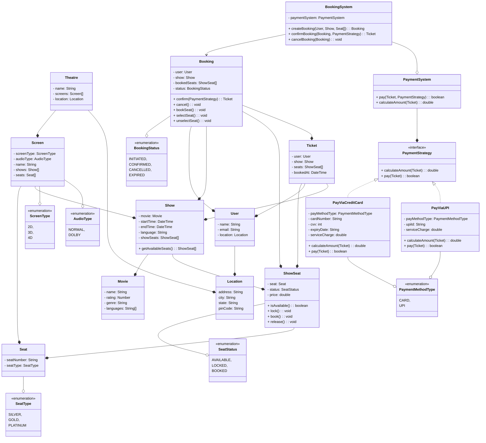
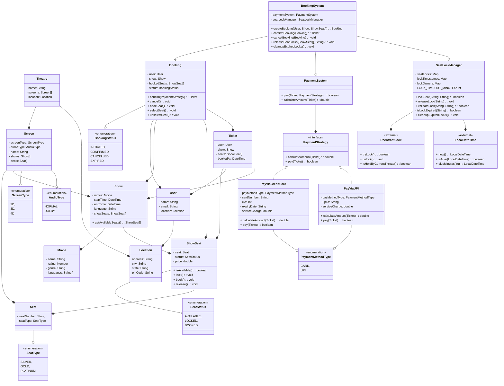

### Design BookMyShow

## Create a movie booking management system like BookMyShow to allow a user to search and book movie tickets.

## Requirements
* Support for multiple cities
* Each city will have multiple cinema theatre
* Each cinema can have multiple screens
* Each screen will play one movie at a time
* A theatre will play multiple movies
* Each movie can have multiple shows
* Each screen can have multiple types of seats
    - GOLD
    - DIAMOND
    - PLATINUM
* Allow the user to search a movie by name
* Allow the user to filter movies by the following fields
    - Location
    - Cinema
    - Language
    - Rating
    - Category
* Users can book tickets and pay via multiple payment methods
    - UPI
    - Credit Card
    - Netbanking
* A user can apply a coupon or a promo code at checkout
* A user can see the availability of seats in a hall
* The price of a ticket will be decided by multiple parameters
    - Seat Type
    - Day of the week
    - Time of the Day
    - Movie
    - Cinema hall
* A user can also cancel or update a booking
* A user cannot book or cancel after the cutoff time which is 1 hour before the movie starts

## Entities and Attributes

* User
    - name: String
    - email: String
    - location: Location

* Screen
    - screenType: `2D 3D 4D`
    - audioType: `DOLBY NORMAL`
    - name: String
    - shows: Show[]
    - seats: Seats[]

* Show
    - movie: Movie
    - time: String
    - language: String

* Movie
    - name: String
    - rating: Number
    - genre: String

* Theatre
    - screens: Screen[]
    - name: String
    - address: String
    - city: String
    - state: String
    - pinCode: String

* Seat
    - status: `BOOKED AVAILABLE`
    - seatNumner: String
    - seatType: `SILVER GOLD PLATINUM`
    - price: Double

* Ticket
    - ticketId: String
    - bookingStatus: `IN-PROGRESS FAILED COMPLETED CANCELED`
    - seats: Seat[]
    - bookedAt: String

* BookingSystem
    - checkSeatAvailablilty(Seat[], Screen): boolean
    - issueTicket(Seat[], User, Screen): Ticket
    - cancelTicket(Ticket): boolean

* Search
    - search(input, type)

* PaymentSystem
    - pay()

## Problems
* Concurrency not handled

## Problems
* ~~Concurrency not handled~~

