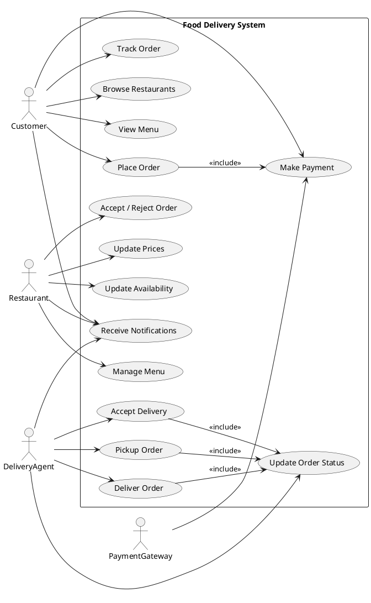

## Requirements
1. The food delivery service should allow customers to browse restaurants, view menus, and place orders.
2. Restaurants should be able to manage their menus, prices, and availability.
3. Delivery agents should be able to accept and fulfill orders.
4. The system should handle order tracking and status updates.
5. The system should support multiple payment methods.
6. The system should handle concurrent orders and ensure data consistency.
7. The system should be scalable and handle a high volume of orders.
8. The system should provide real-time notifications to customers, restaurants, and delivery agents.

### Entities and Attributes

* Resturent
    - Menu
    - Location
* Menu
    - dish
* Order
    - resturent
    - agent
    - dish
    - price
* Delivery Agent
* Dish
    - price
    - quantity
* User
    - Location

### Use case Diagram

```mermaid
classDiagram
    %% ================= FACADE PATTERN =================
    class FoodDeliverySystem {
        - instance : FoodDeliverySystem$
        - orderService : OrderService
        - resturentSearchService : SearchService~Resturent~
        - menuSearchService : SearchService~Menu~
        - paymentService : PaymentService
        - userRepository : UserRepository
        - resturentRepository : ResturentRepository
        - agentRepository : AgentRepository
        - menuRepository : MenuRepository
        + getInstance()$ FoodDeliverySystem
        + registerUser(User)
        + registerResturent(Resturent)
        + registerAgent(Agent)
        + addMenu(Menu)
        + browseResturents(query) List~Resturent~
        + browseMenus(query) List~Menu~
        + placeOrder(Order, resturentId) Order
        + confirmOrder(orderId)
        + prepareOrder(orderId)
        + orderReadyForPickup(orderId)
        + assignAgent(orderId)
        + startDelivery(orderId)
        + completeDelivery(orderId)
        + cancelOrder(orderId)
        + trackOrder(orderId) Order
        + setPaymentStrategy(PaymentStrategy)
        + processPayment(amount) boolean
    }

    %% ================= SERVICES =================
    class OrderService {
        - orderRepository : OrderRepository
        - userRepository : UserRepository
        - resturentRepository : ResturentRepository
        - agentRepository : AgentRepository
        + placeOrder(Order, resturentId) Order
        + confirmOrder(orderId)
        + prepareOrder(orderId)
        + orderReadyForPickup(orderId)
        + assignAgent(orderId)
        + startDelivery(orderId)
        + completeDelivery(orderId)
        + cancelOrder(orderId)
    }

    class SearchService~T~ {
        - searchStrategy : SearchStrategy~T~
        + setSearchStrategy(SearchStrategy~T~)
        + search(query) List~T~
    }

    class PaymentService {
        - paymentStrategy : PaymentStrategy
        + setPaymentStrategy(PaymentStrategy)
        + processPayment(amount) boolean
    }

    %% ================= REPOSITORIES (Singleton) =================
    class UserRepository {
        + getInstance()$
        + registerUser(User)
        + getUser(userId)
    }
    class ResturentRepository {
        + getInstance()$
        + registerResturent(Resturent)
        + searchResturent(query)
    }
    class AgentRepository {
        + getInstance()$
        + registerAgent(Agent)
        + findAvailableAgent()
    }
    class MenuRepository {
        + getInstance()$
        + addMenu(Menu)
        + searchMenu(query)
    }
    class OrderRepository {
        + getInstance()$
        + createOrder(Order)
        + getOrder(orderId)
    }

    %% ================= OBSERVER PATTERN =================
    class OrderSubject {
        - observers : List~OrderObserver~
        + addObserver(OrderObserver)
        + removeObserver(OrderObserver)
        + notifyObservers()
    }

    class OrderObserver {
        <<interface>>
        + update(Order)
    }

    class Order {
        - orderId : String
        - orderStatus : OrderStatus
        - dishes : List~Dish~
        + updateStatus(OrderStatus)
    }

    OrderSubject <|-- Order
    OrderObserver <|.. User
    OrderObserver <|.. Resturent
    OrderObserver <|.. Agent

    %% ================= STRATEGY PATTERN (SEARCH) =================
    class SearchStrategy~T~ {
        <<interface>>
        + search(query) List~T~
    }

    class SearchByResturent {
        + search(query) List~Resturent~
    }

    class SearchByMenu {
        + search(query) List~Menu~
    }

    SearchService --* SearchStrategy

    SearchStrategy <|.. SearchByResturent
    SearchStrategy <|.. SearchByMenu

    %% ================= STRATEGY PATTERN (PAYMENT) =================
    class PaymentStrategy {
        <<interface>>
        + processPayment(amount) boolean
    }

    class CardPayment {
        + processPayment(amount)
    }
    class UPIPayment {
        + processPayment(amount)
    }
    class CashOnDelivery {
        + processPayment(amount)
    }

    PaymentService --* PaymentStrategy

    PaymentStrategy <|.. CardPayment
    PaymentStrategy <|.. UPIPayment
    PaymentStrategy <|.. CashOnDelivery

    %% ================= MODELS =================
    class User {
        - userId : String
        - name : String
        + update(Order)
    }

    class Resturent {
        - resturentId : String
        - name : String
        - menus : List~Menu~
        + update(Order)
    }

    class Agent {
        - agentId : String
        - name : String
        - available : boolean
        + update(Order)
    }

    class Menu {
        - menuId : String
        - title : String
        - dishes : List~Dish~
    }

    class Dish {
        - dishId : String
        - name : String
        - price : Double
    }

    %% ================= RELATIONSHIPS =================
    FoodDeliverySystem --> OrderService
    FoodDeliverySystem --> SearchService
    FoodDeliverySystem --> PaymentService
    
    OrderService --> OrderRepository
    OrderService --> UserRepository
    OrderService --> ResturentRepository
    OrderService --> AgentRepository

    Resturent --> Menu
    Menu --> Dish
    Order --> Dish
```

