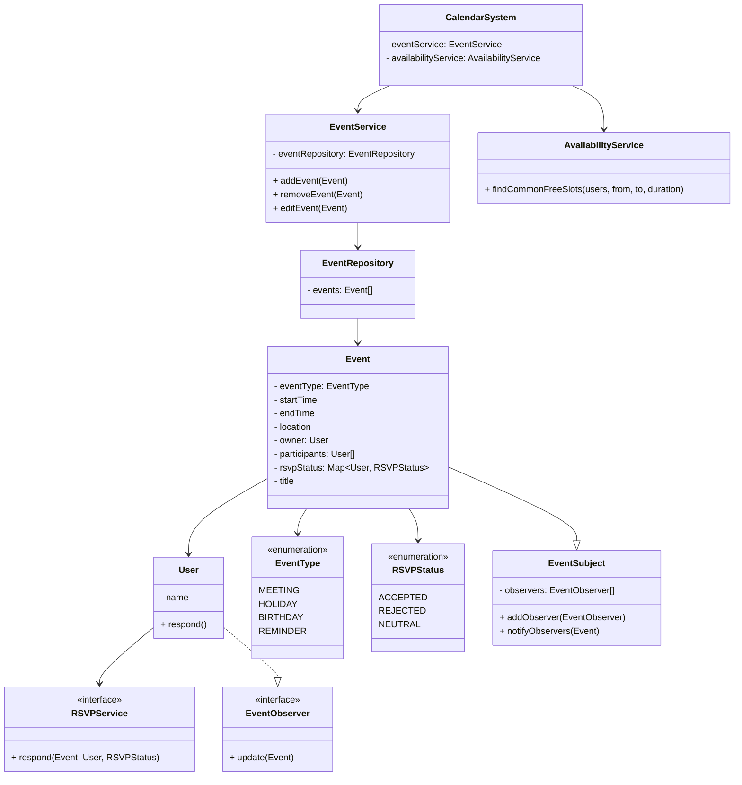

## Requirements

Design a calendar Application (similar like Google Calendar)
* Ability to create, update, delete an Event
* An event would typically consist of {start, end, location, Owner, user-list, title}.
* Events can either be like meetings(with a dedicated location and appropriate guest-list) or as well be like holidays, birthdays, reminders etc.
* An event once created, can be either accepted or rejected by the constituent users - if neither it should be in neutral state.
* Get Calendar for a user Ui
* Get Event details.
* For a given set of users[U1, U2,....Un] identity a common free slot of time.

## Entites and Attributes

- User
- Event
- Calendar

