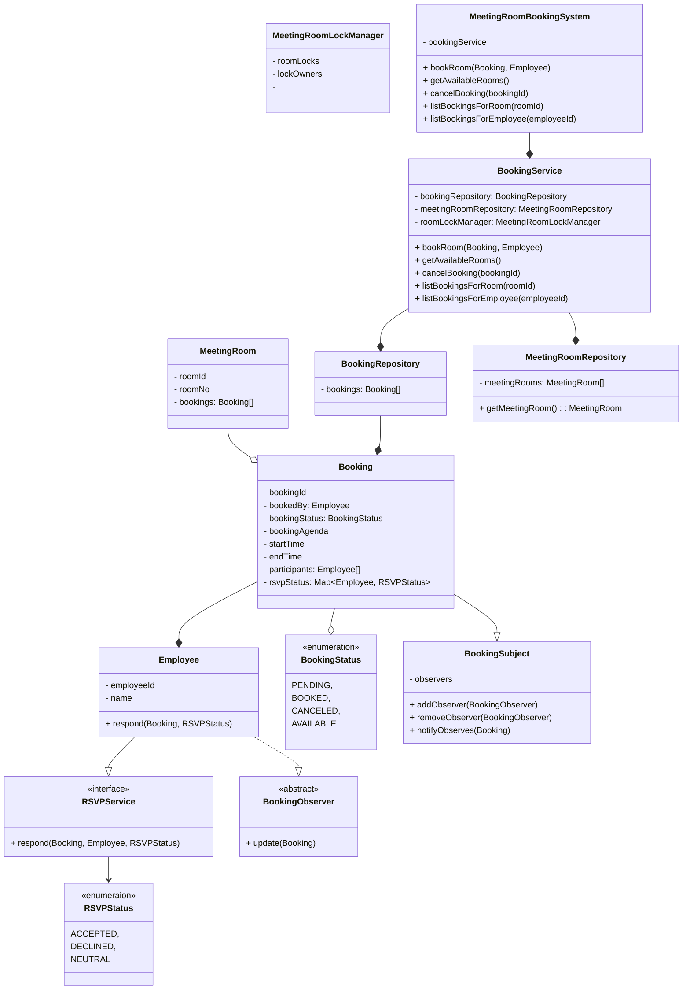

## Requirements

Design a Meeting Room Reservation SystemDesign the low-level system for a Meeting Room Reservation Platform that allows employees in an organization to book rooms for meetings, check availability, and manage bookings.
The system should support the following core features:
Requirements:
Functional Requirements:
1. An employee can view all available meeting rooms for a given time interval.
2. An employee can book a meeting room if it is free during the requested time.
3. Ability to cancel an existing meeting.
4. Handle overlapping meeting requests gracefully.
5. Ability to list all meetings scheduled for a given room or employee.
6. Support recurring meetings (optional enhancement).

## Entities Involved:
* Employee
* MeetingRoom
* Booking
* TimeSlot or Interval

## Operations:
* bookRoom(employeeId, roomId, startTime, endTime)
* getAvailableRooms(startTime, endTime)
* cancelBooking(bookingId)
* listBookingsForRoom(roomId)
* listBookingsForEmployee(employeeId)

## Constraints to Consider:
* No double-booking of the same room at overlapping times.
* Extensibility for many rooms and bookings.
* Concurrency: Handle race conditions where two users try to book the same room at the same time.

## Design Expectations:
* Define classes with proper responsibilities.
* Handle edge cases (invalid time range, no available rooms, overlapping bookings).

## Example Scenario:
- Room A is booked from 10:00 AM to 11:00 AM.
- User X tries to book Room A from 10:30 AM to 11:30 AM → Booking should fail due to overlap.
- User Y books Room B from 10:30 AM to 11:30 AM → Booking successful.

## Class Diagram

