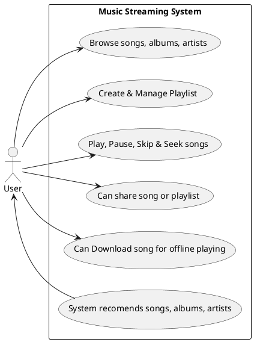

# Designing an Online Music Streaming Service Like Spotify

## Requirements
1. The music streaming service should allow users to browse and search for songs, albums, and artists.
2. Users should be able to create and manage playlists.
3. The system should support user authentication and authorization.
4. Users should be able to play, pause, skip, and seek within songs.
5. The system should recommend songs and playlists based on user preferences and listening history.
6. The system should handle concurrent requests and ensure smooth streaming experience for multiple users.
7. The system should be scalable and handle a large volume of songs and users.
8. The system should be extensible to support additional features such as social sharing and offline playback.

## Enitites and Attributes

* Song
    - artist
* Album
    - songs[]
* Artist
* User
* Playlist
    - songs[]
* Player

```mermaid
classDiagram
    %% ===================== FACADE PATTERN =====================
    
    class MusicStramingFacade {
        - recomendataionService: RecomendataionService
        - searchService: SearchService
        - player: Player
        - songRepository: SongRepository
        - userRepository: UserRepository
        - artistRepository: ArtistRepository
        + getMusicInstance()$ MusicStramingFacade
        + registerUser(User)
        + registerArtist(Artist)
        + addSong(Song)
        + search(query) List~Song~
        + searchByTitle(title) List~Song~
        + searchByArtist(artistId) List~Song~
        + setSearchStrategy(SearchStrategy)
        + getRecomendation(userId) List~Song~
        + getRecomendationByListeningHistory(userId) List~Song~
        + getRecomendationByFollowedArtists(userId) List~Song~
        + setRecomendationStrategy(RecomendationStrategy)
        + addToQueue(Song)
        + playSong()
        + pauseSong()
        + skipSong()
        + seekSong(positionInSeconds)
        + stopSong()
        + displayQueue()
        + recordListening(userId, songId)
        + followArtist(userId, artistId)
        + unfollowArtist(userId, artistId)
    }

    %% ===================== MODELS =====================

    class User {
        - userId: String
        - name: String
        - email: String
        - playLists: List~PlayList~
        - followedArtists: List~Artist~
        - listeningHistory: List~Song~
        + User(userId, name, email)
        + addToListeningHistory(Song)
        + addPlaylist(PlayList)
        + removePlayList(PlayList)
        + followArtist(Artist)
        + unfollowArtist(Artist)
    }

    class Song {
        - songId: String
        - title: String
        - duration: Double
        - artistId: String
        + Song(songId, title, duration, artistId)
        + toString() String
    }

    class Artist {
        - artistId: String
        - name: String
        - songs: List~Song~
        + Artist(artistId, name)
        + addSong(Song)
        + toString() String
    }

    class Album {
        - albumId: String
        - name: String
        - songs: List~Song~
        + Album(albumId, name)
        + addSong(Song)
        + toString() String
    }

    class PlayList {
        - name: String
        - songs: List~Song~
        + PlayList(name, songs)
        + addSong(Song)
        + removeSong(Song)
    }

    User "1" --> "*" PlayList
    User "1" --> "*" Artist : follows
    User "1" --> "*" Song : listeningHistory
    Album "1" --> "*" Song
    Artist "1" --> "*" Song

    %% ===================== REPOSITORIES (Singleton) =====================

    class SongRepository {
        - instance$: SongRepository
        - songs: Map~String, Song~
        + getInstance()$ SongRepository
        + addSong(Song)
        + getSong(songId) Song
        + getAllSongs() List~Song~
        + searchByTitle(title) List~Song~
        + searchByArtistId(artistId) List~Song~
    }

    class UserRepository {
        - instance$: UserRepository
        - users: Map~String, User~
        + getInstance()$ UserRepository
        + addUser(User)
        + getUser(userId) User
        + userExists(userId) boolean
    }

    class ArtistRepository {
        - instance$: ArtistRepository
        - artists: Map~String, Artist~
        + getInstance()$ ArtistRepository
        + addArtist(Artist)
        + getArtist(artistId) Artist
        + artistExists(artistId) boolean
    }

    %% ===================== PLAYER =====================

    class Player {
        - playerState: PlayerState
        - queue: LinkedList~Song~
        - currentSong: Song
        - currentPosition: int
        + Player()
        + addToQueue(Song)
        + play()
        + pause()
        + seek(positionInSeconds)
        + skip()
        + stop()
        + displayQueue()
    }

    class PlayerState {
        <<enumeration>>
        PLAYING
        PAUSED
        STOPPED
    }

    Player --> PlayerState
    Player --> Song : currentSong

    %% ===================== SEARCH (Strategy Pattern) =====================

    class SearchService {
        - searchStrategy: SearchStrategy
        + SearchService()
        + SearchService(SearchStrategy)
        + setSearchStrategy(SearchStrategy)
        + search(query) List~Song~
    }

    class SearchStrategy {
        <<interface>>
        + search(query) List~Song~
    }

    class SearchByTitle {
        - songRepository: SongRepository
        + SearchByTitle()
        + search(query) List~Song~
    }

    class SearchByArtist {
        - songRepository: SongRepository
        + SearchByArtist()
        + search(artistId) List~Song~
    }

    SearchByTitle ..|> SearchStrategy
    SearchByArtist ..|> SearchStrategy
    SearchService --> SearchStrategy
    SearchByTitle --> SongRepository
    SearchByArtist --> SongRepository

    %% ===================== RECOMMENDATION (Strategy Pattern) =====================

    class RecomendataionService {
        - recomendationStrategy: RecomendationStrategy
        - userRepository: UserRepository
        + RecomendataionService()
        + RecomendataionService(RecomendationStrategy)
        + setRecomendationStrategy(RecomendationStrategy)
        + getRecomendation(userId) List~Song~
    }

    class RecomendationStrategy {
        <<interface>>
        + getRecomendation(User) List~Song~
    }

    class RecomendByListingHistory {
        - songRepository: SongRepository
        + RecomendByListingHistory()
        + getRecomendation(User) List~Song~
    }

    class RecomendByFollowedArtist {
        - songRepository: SongRepository
        - artistRepository: ArtistRepository
        + RecomendByFollowedArtist()
        + getRecomendation(User) List~Song~
    }

    RecomendByListingHistory ..|> RecomendationStrategy
    RecomendByFollowedArtist ..|> RecomendationStrategy
    RecomendataionService --> RecomendationStrategy
    RecomendataionService --> UserRepository
    RecomendByListingHistory --> SongRepository
    RecomendByFollowedArtist --> SongRepository
    RecomendByFollowedArtist --> ArtistRepository

    %% ===================== FACADE RELATIONSHIPS =====================

    MusicStramingFacade --> SearchService
    MusicStramingFacade --> RecomendataionService
    MusicStramingFacade --> Player
    MusicStramingFacade --> SongRepository
    MusicStramingFacade --> UserRepository
    MusicStramingFacade --> ArtistRepository
```






## Implementation Notes

### Design Patterns Used

1. **Facade Pattern** - `MusicStramingFacade` provides a simplified interface to the complex subsystem
2. **Strategy Pattern** - Used in:
   - `SearchService` with `SearchStrategy` interface (SearchByTitle, SearchByArtist)
   - `RecomendataionService` with `RecomendationStrategy` interface (RecomendByListingHistory, RecomendByFollowedArtist)
3. **Singleton Pattern** - Used in:
   - `MusicStramingFacade.getMusicInstance()`
   - `SongRepository.getInstance()`
   - `UserRepository.getInstance()`
   - `ArtistRepository.getInstance()`

### Package Structure

```
musicStreaming/
├── facade/
│   └── MusicStramingFacade.java       # Main facade (entry point)
├── models/
│   ├── Song.java
│   ├── Artist.java
│   ├── Album.java
│   ├── User.java
│   └── PlayList.java
├── player/
│   ├── Player.java
│   └── PlayerState.java               # Enum
├── repository/
│   ├── SongRepository.java            # Singleton
│   ├── UserRepository.java            # Singleton
│   └── ArtistRepository.java          # Singleton
├── search/
│   ├── SearchStrategy.java            # Interface
│   ├── SearchService.java
│   ├── SearchByTitle.java
│   └── SearchByArtist.java
├── recomendation/
│   ├── RecomendationStrategy.java     # Interface
│   ├── RecomendataionService.java
│   ├── RecomendByListingHistory.java
│   └── RecomendByFollowedArtist.java
├── auth/                              # Future: Authentication
├── offline/                           # Future: Offline playback
├── MusicStreamingDemo.java            # Demo class
└── MusicStreamingSystemDesign.md      # This file
```

### How to Run

```bash
./mvnw exec:java -Dexec.mainClass="com.lld.lld.musicStreaming.MusicStreamingDemo" -q
```