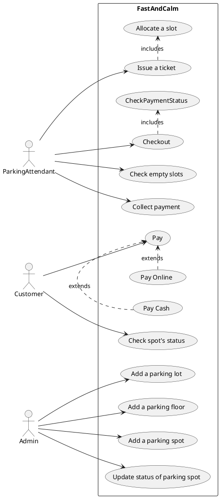
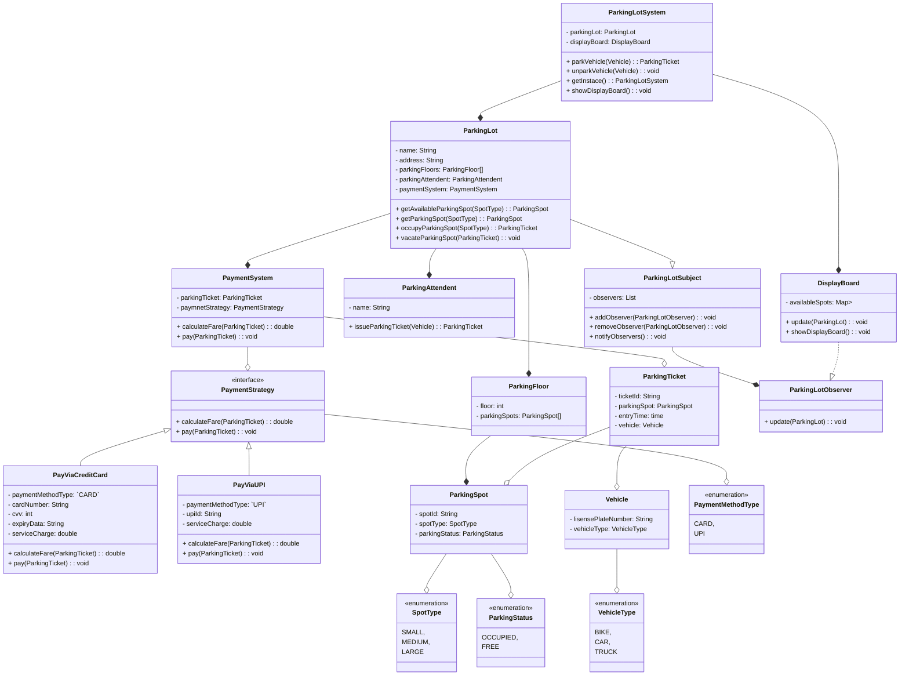

## Requirements

Build an online parking lot management system that can support the following requirements:

* Should have multiple floors.
* Multiple entries and exit gates.
* A user has to collect a ticket at entry and pay at or before exit.
* Pay at: Exit counter (Cash to the parking attendant)
* Dedicated automated booth on each floor - Payment counter

* Payment via type:
    - Cash
    - Credit Card
    - UPI
* Allow entry for a vehicle if a spot is available for it.
* Show on the display board at entry if a spot is not available.
* Parking Spots of 3 types:
    - Large
    - Medium
    - Small
* A car can only be parked at its spot. Not on any other (even larger).
* A display on each floor with the status of that floor.
* Fees calculated based on per hour price: e.g. 50 rs for the first hour, then 80 rs per  extra hour. invoice
    - Small - 50, 80
    - Medium - 80, 100
    - Large - 100, 120

## Use Case Diagram

## Entities and Attributes

* ParkingLotSystem
    * ParkingLot
    * DisplayBoard

* ParkingLot
  * Name
  * Address
  * ParkingFloors
  * ParkingAttendent

* ParkingFloor
  * Floor Number
  * ParkingSpots

* ParkingSpot
  * Spot Number
  * Spot Type - `Large, Medium, Small`
  * Status - `Occupied, Free, Out of order`

* ParkingTicket
  * Ticket ID
  * ParkingSpot
  * Entry Time
  * Vehicle
  
* PaymentSystem
  * Ticket
  * PaymentStrategy
  
* Vehicle
  * License Plate
  * Vehicle Type - `Car, Truck, Bus, Bike, Scooter`

* ParkingAttendent
  * Name
  * DisplayBoard
  * PaymentSystem

## Facade + Observer + Strategy Design Pattern
* Facade - (ParkingLotSystem to hide all unnecessary details like Payment) 
* Observer - (ParkingLotObserver to update DisplayBoard)
* Strategy - (PaymentSystem to incorporate different methods of Payment)

