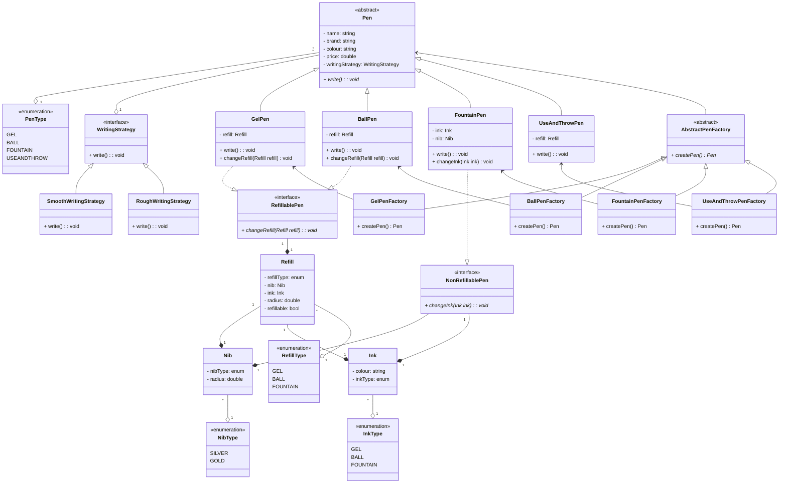

# Design a pen

## Requirements

* A pen is anything that can write.
* Pen can be Gel, Ball, Fountain, Marker.
* Ball Pen and Gel Pen have a Ball Pen Refill and a Gel Pen Refill respectively to write.
* A refil has a tip and an ink.
* Ink can be of different colour
* A fountain pen has an Ink.
* Refil has a radius. 
* For fountain pen, its tip has a radius.
* Each pen can write in a different way.
* Some pens write in the same way.
* Every pen has a brand and a name.
* Some pens may allow refilling while others might not.

## Enteties and Attributes

* Pen
    - penType: (GEL, BALL, FOUNTAIN, USEANDTHROW)
    - refill: Refill
    - ink: Ink
    - nib: Nib
    - brand
    - color
    - name
    - price

## Drawbacks
* SRP is violated as Pen class is having all differennt methods.
* OCP is violated as if I add new type of Pen then we need to open then Pen class.
* Object creation is complex.
* Need to handle refill and write method for each type of pen separately.

## Drawbacks
* ~~SRP is violated as Pen class is having all differennt methods.~~
* ~~OCP is violated as if I add new type of Pen then we need to open then Pen class.~~
* Object creation is complex.
* LSP is violated as Fountain pen thorws exception when changeRefill is called since fountain pen does not have refill.
* subClass are used to create class.
* Code duplicacy
* Class Explosion

## Using Abstract class

## Drawbacks
* ~~SRP is violated as Pen class is having all differennt methods.~~
* ~~OCP is violated as if I add new type of Pen then we need to open then Pen class.~~
* Object creation is complex.
* ~~LSP is violated as Fountain pen thorws exception when changeRefill is called since fountain pen does not have refill.~~
* subClass are used to create class.
* Code duplicacy
* Class Explosion

## Using Interface

## Drawbacks
* ~~SRP is violated as Pen class is having all differennt methods.~~
* ~~OCP is violated as if I add new type of Pen then we need to open then Pen class.~~
* Object creation is complex.
* ~~LSP is violated as Fountain pen thorws exception when changeRefill is called since fountain pen does not have refill.~~
* subClass are used to create class.
* ~~Code duplicacy~~
* Class Explosion

Using Factory Method along with Builder 

