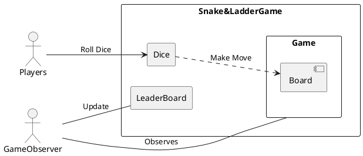
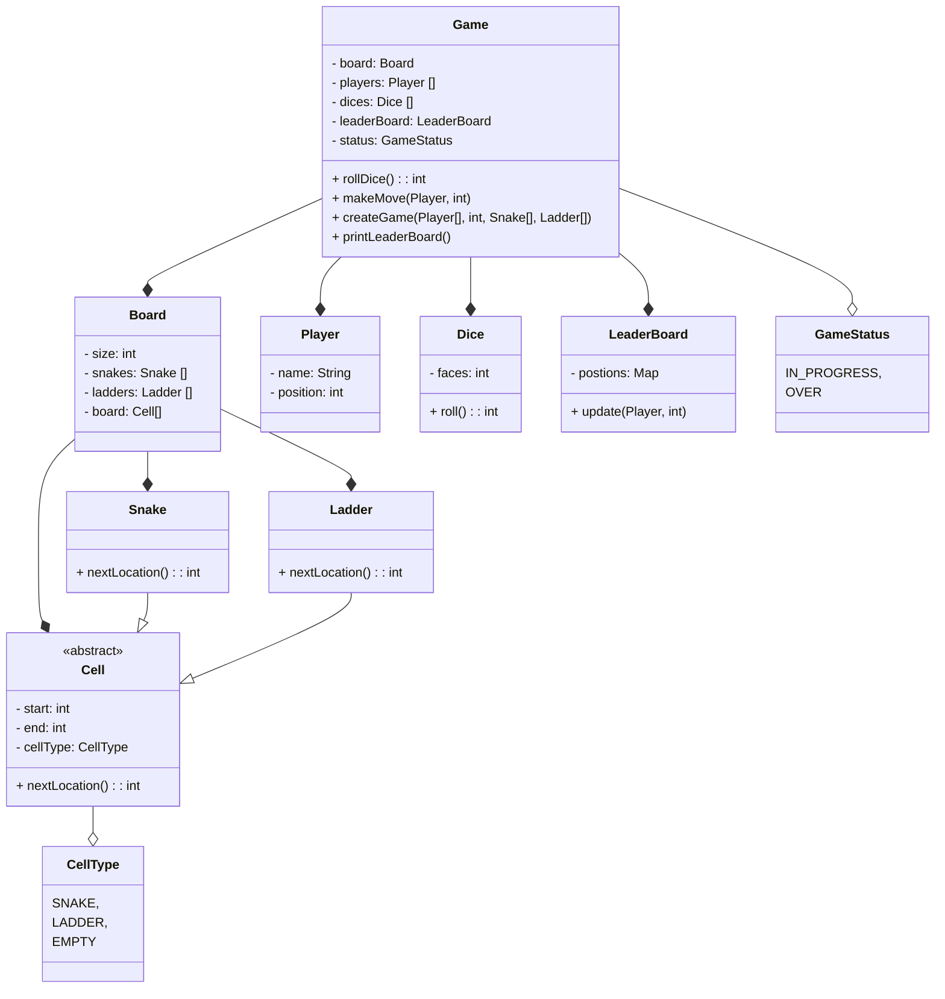

## Requirements

* A board for playing Snake and Ladder game
* Players will roll dice, and palce pawn according to number on dice.
* Board will have Snakes and Ladders at different position.
* The first to reach at last wins the game.
* Start Rule, player can only start when they get 6.
* If player get 6, then he can roll dice again.
* If player get 3 times 6 then his turn will cancel.
* Leaderboard to show current pisition of players.

## Entities and Attributes

* Game
    - Board
    - Players
    - Dice
    - LeaderBoard
    - status

* Board
    - Cell
        - number
        - nextPosOfCell
        - type
* Player
    - name
    - position
    - cellToMove

* Dice
    - 1 to 6 number
    - cellToMove

* Leaderboard
    - player score

## Class Diagram

