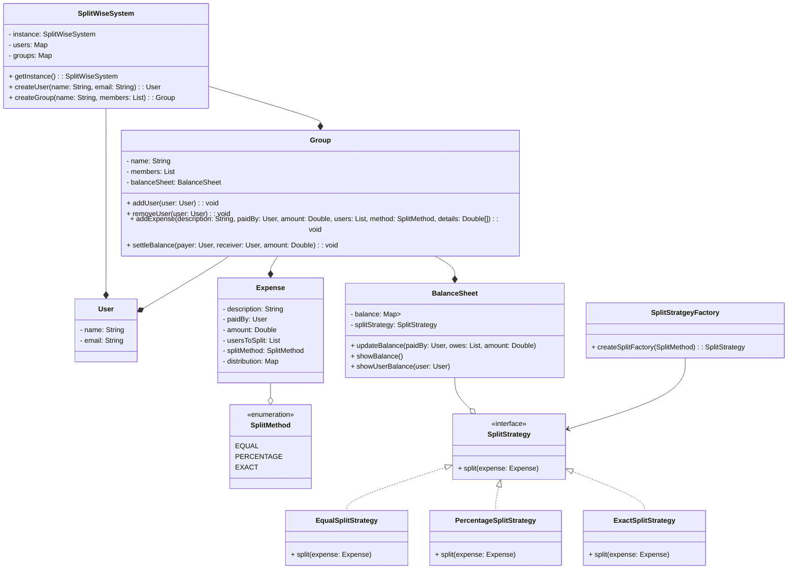

# Designing Splitwise

## Requirements
1. The system should allow users to create accounts and manage their profile information.
2. Users should be able to create groups and add other users to the groups.
3. Users should be able to add expenses within a group, specifying the amount, description, and participants.
4. The system should automatically split the expenses among the participants based on their share.
5. Users should be able to view their individual balances with other users and settle up the balances.
6. The system should support different split methods, such as equal split, percentage split, and exact amounts.
7. Users should be able to view their transaction history and group expenses.
8. The system should handle concurrent transactions and ensure data consistency.

## Entities and Attributes

* User
* Group
* Expense
* Transaction

## UML Class Diagram

