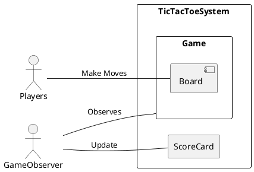
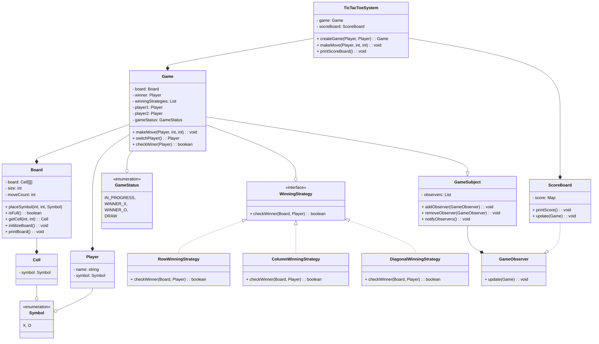

## Problem Requirements
* The game is played on a 3x3 grid.
* Two players take alternate turns, identified by markers ‘X’ and ‘O’.
* The game should detect and announce the winner.
* The game should declare a draw if all cells are filled and no player has won.
* The game should reject invalid moves and inform the player.
* The system should maintain a scoreboard across multiple games.
* Moves can be hardcoded in a driver/demo class to simulate gameplay.

## Enteties and Attributes
* `Board`: Represents the 3x3 game grid. Manages a 2D matrix of cells and provides methods to update cell values, validate positions, and check for win or draw conditions.
* `Cell`: Represents an individual square on the board. Each cell can either be empty or contain a symbol `(X or O)`.
* `Player`: Represent a player with a symbol and optionally a name or ID.
* `Symbol`: Represents the value a cell can hold—X, O, or EMPTY.
* `Game`: Controls the overall game flow. Alternates turns, validates moves, updates the board, and checks for winning or draw conditions.
* `GameStatus`: Represents the current state of the game. Possible values include `IN_PROGRESS`, `DRAW`, `WINNER_X`, and `WINNER_O`.
* `Scoreboard`: Tracks cumulative scores and outcomes across multiple game sessions.
* `TicTacToeSystem`: Orchestrates the creation of games and ties together core components like the scoreboard and game engine.

## Use Case Diagram

## Initial Design

